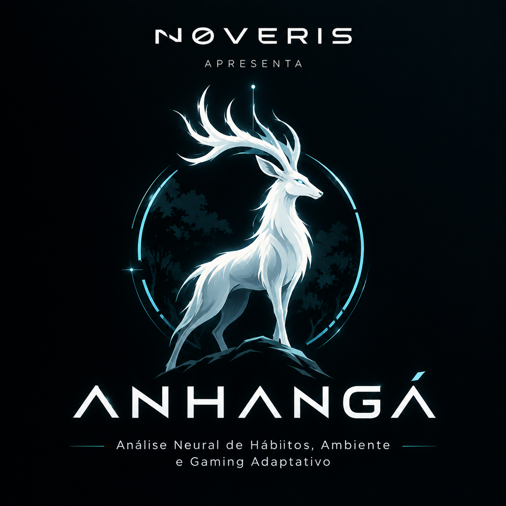

  <!-- Logo/Banner do Projeto -->
  . alt="Noveris Anhangá Logo" width="420"/>

  # 🦌 ANHANGÁ
  ### Análise Neural de Hábitos, Ambiente e Gaming Adaptativo

  *Uma solução de Inteligência Artificial para a **Smart Home 2050** por **NOVERIS***

  

    <a href="#-sobre-o-projeto">Sobre</a> •
    <a href="#-arquitetura-e-fluxo-de-dados">Arquitetura</a> •
    <a href="#-funcionalidades">Funcionalidades</a> •
    <a href="#-tecnologias">Tecnologias</a> •
    <a href="#-como-executar">Como Executar</a> •
    <a href="#-licença">Licença</a>
  

  <!-- Badges de Status e Tecnologias -->
  

    
    
    
  

  

    
    
    
  

---

## 📌 Sobre o Projeto

O **ANHANGÁ** é uma plataforma de Inteligência Artificial desenvolvida pela **NOVERIS** dentro do ecossistema de **Smart Home 2050**, projetada para compreender e otimizar sessões de gaming no ambiente doméstico.

A solução conecta **Engenharia de Dados**, **Machine Learning** e **IA Generativa com Processamento de Linguagem Natural (NLP)** para transformar o monitoramento contínuo da rotina do jogador e dos sensores do seu ambiente em insights acionáveis e inteligência adaptativa.

> *Inspirado na entidade protetora da fauna e das matas do folclore brasileiro, o **ANHANGÁ** atua como uma guarda silenciosa e inteligente sobre o bem-estar e a performance do usuário no ambiente doméstico.*

---

## ⚙️ Arquitetura e Fluxo de Dados
