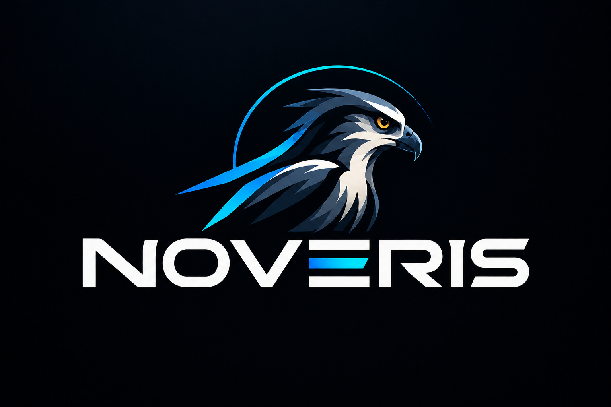

<div align="center">

  <!-- Logo da Empresa (NOVERIS) -->
  
  
  <p><b>A P R E S E N T A</b></p>

  <!-- Banner/Logo da IA (ANHANGÁ) -->
  

  # 🦌 ANHANGÁ
  ### Análise Neural de Hábitos, Ambiente e Gaming Adaptativo

  *Uma solução de Inteligência Artificial para a **Smart Home 2050** por **NOVERIS***

  <p>
    <a href="#-sobre-o-projeto">Sobre</a> •
    <a href="#-curiosidade-a-origem-do-nome">Curiosidade</a> •
    <a href="#-arquitetura-e-fluxo-de-dados">Arquitetura</a> •
    <a href="#-métricas-e-parâmetros">Métricas</a> •
    <a href="#-funcionalidades">Funcionalidades</a> •
    <a href="#-tecnologias">Tecnologias</a> •
    <a href="#-como-executar">Como Executar</a> •
    <a href="#-licença">Licença</a>
  </p>

  <!-- Badges de Status e Tecnologias -->
  <p>
    
    
    
  </p>
  <p>
    
    
    
  </p>

</div>

---

## 📌 Sobre o Projeto

O **ANHANGÁ** é uma plataforma de Inteligência Artificial desenvolvida pela **NOVERIS** dentro do ecossistema de **Smart Home 2050**, projetada para compreender e otimizar sessões de gaming no ambiente doméstico.

A solução conecta **Engenharia de Dados**, **Machine Learning** e **IA Generativa com Processamento de Linguagem Natural (NLP)** para transformar o monitoramento contínuo da rotina do jogador e dos sensores do seu ambiente em insights acionáveis e inteligência adaptativa.

---

## 💡 Curiosidade: A Origem do Nome

> Na mitologia e folclore brasileiro, o **Anhangá** é reconhecido como o espírito protetor da fauna, da flora e das matas. Ele não é uma figura punitiva, mas sim um **guardião invisível e adaptativo** que preserva o equilíbrio do ecossistema.

A **NOVERIS** escolheu esse nome para simbolizar a essência do projeto: uma Inteligência Artificial que atua como uma **guarda silenciosa sobre o ambiente doméstico do jogador**, monitorando variáveis em tempo real sem interromper a imersão, garantindo o equilíbrio entre alta performance em gaming e saúde/bem-estar na Smart Home 2050.

---

## ⚙️ Arquitetura e Fluxo de Dados

A arquitetura do sistema é dividida em três pilares principais de processamento:

```mermaid
flowchart TD
    A[Sensores IoT / Telemetria Ambientais] -->|Dados em Tempo Real| B[Camada de Ingestão & Processamento]
    C[Métricas de Gaming & Sessão] -->|Histórico e Frequência| B
    B --> D[Modelos de Machine Learning - Anomalias]
    B --> E[IA Generativa & Processamento NLP]
    D --> F[Ações Adaptativas na Smart Home]
    E --> G[Relatórios Conversacionais e Alertas]
